# Respuestas a las principales cuestiones de Inteligencia Artificial

> Autor: Andrés Millán.
> Referencias recogidas de libros, diapositivas, varias páginas de internet y otros documentos.


<!-- @import "[TOC]" {cmd="toc" depthFrom=1 depthTo=6 orderedList=false} -->

<!-- code_chunk_output -->

- [Respuestas a las principales cuestiones de Inteligencia Artificial](#respuestas-a-las-principales-cuestiones-de-inteligencia-artificial)
- [Primera parte](#primera-parte)
  - [1. El concepto de Agente. Agente racionales vs Agentes inteligentes. Arquitecturas de Agentes](#1-el-concepto-de-agente-agente-racionales-vs-agentes-inteligentes-arquitecturas-de-agentes)
  - [2. Características de los Agentes reactivos y deliberativos. Similitudes y diferencias. Arquitecturas](#2-características-de-los-agentes-reactivos-y-deliberativos-similitudes-y-diferencias-arquitecturas)
    - [Agentes reactivos](#agentes-reactivos)
      - [Arquitectura de subsunción](#arquitectura-de-subsunción)
      - [Agentes reactivos con memoria](#agentes-reactivos-con-memoria)
      - [Sistemas basados en pizarras](#sistemas-basados-en-pizarras)
    - [Agentes deliberativos](#agentes-deliberativos)
  - [3. Describir brevemente los métodos de búsqueda no informada](#3-describir-brevemente-los-métodos-de-búsqueda-no-informada)
    - [Búsqueda en anchura](#búsqueda-en-anchura)
    - [Búsqueda de Costo Uniforme](#búsqueda-de-costo-uniforme)
    - [Búsqueda en profundidad](#búsqueda-en-profundidad)
    - [Búsqueda bidireccional](#búsqueda-bidireccional)
  - [4. El concepto de heurística. Cómo se construyen las heurísticas. Uso de las heurísticas en IA](#4-el-concepto-de-heurística-cómo-se-construyen-las-heurísticas-uso-de-las-heurísticas-en-ia)
    - [El concepto de heurística](#el-concepto-de-heurística)
    - [Cómo se construyen las heurísticas](#cómo-se-construyen-las-heurísticas)
    - [Uso de las heurísticas en IA](#uso-de-las-heurísticas-en-ia)
  - [5. Los métodos de escalada. Caracterización general. Variantes](#5-los-métodos-de-escalada-caracterización-general-variantes)
  - [6. Características esenciales de los métodos “primero el mejor”](#6-características-esenciales-de-los-métodos-primero-el-mejor)
  - [7. Elementos esenciales del algoritmo A*](#7-elementos-esenciales-del-algoritmo-a)
    - [Propiedades](#propiedades)
    - [Limitaciones](#limitaciones)
  - [8. Elementos esenciales de un algoritmo genético](#8-elementos-esenciales-de-un-algoritmo-genético)
- [Segunda parte](#segunda-parte)
  - [1. Componentes de un juego](#1-componentes-de-un-juego)
  - [2. ¿Qué es el factor de ramificación y cómo afecta a la complejidad de un juego? Describe en líneas generales el algoritmo minimax y el de la poda alfa-beta](#2-qué-es-el-factor-de-ramificación-y-cómo-afecta-a-la-complejidad-de-un-juego-describe-en-líneas-generales-el-algoritmo-minimax-y-el-de-la-poda-alfa-beta)
    - [Descripción](#descripción)
    - [Algoritmo](#algoritmo)
    - [Optimizando Minimax mediante la poda alfa-beta](#optimizando-minimax-mediante-la-poda-alfa-beta)
  - [3. ¿Qué problemas plantea el cálculo de predicados en la resolución de problemas de IA?](#3-qué-problemas-plantea-el-cálculo-de-predicados-en-la-resolución-de-problemas-de-ia)
    - [Problemas semánticos](#problemas-semánticos)
    - [Problemas computacionales](#problemas-computacionales)
  - [4. Modelos de conocimiento heredable ¿Qué tipo de conocimiento organizan las redes semánticas? Describir en líneas generales el concepto de "frame".](#4-modelos-de-conocimiento-heredable-qué-tipo-de-conocimiento-organizan-las-redes-semánticas-describir-en-líneas-generales-el-concepto-de-frame)
    - [Redes semánticas](#redes-semánticas)
    - [Frames](#frames)
    - [Faceta](#faceta)
  - [5. Estructura y componentes de un sistema experto](#5-estructura-y-componentes-de-un-sistema-experto)
  - [6. Paradigmas de Aprendizaje Automático.](#6-paradigmas-de-aprendizaje-automático)
  - [7. Describir el problema del ruido y el del sobreajuste en aprendizaje automático.](#7-describir-el-problema-del-ruido-y-el-del-sobreajuste-en-aprendizaje-automático)
  - [8. ¿Qué son y cómo se construyen los árboles de decisión?](#8-qué-son-y-cómo-se-construyen-los-árboles-de-decisión)

<!-- /code_chunk_output -->

<div style="page-break-after: always;"></div>

# Primera parte

## 1. El concepto de Agente. Agente racionales vs Agentes inteligentes. Arquitecturas de Agentes

En Inteligencia Artificial, un **agente** es un concepto referido a una entidad autónoma que es capaz de actuar con el fin de obtener un cierto resultado. Es capaz de hacerlo mediante la observación del entorno a través de sensores y relacionándose con este. Sus acciones se realizan de forma autónoma.

Dependiendo de cuál es nuestro objetivo, se pueden diseñar para que se parezcan más a los humanos o para que actúen de forma racional.

Un **agente racional** es aquel que elegirá la opción que maximice su rendimiento, en base a las evidencias que le aportan sus sensores y su conocimiento.

Si nos basamos en el test de Turing, un **agente inteligente** es aquel que es capaz de pasarlo. Es decir, engaña al entrevistador haciéndose pasar por un humano.

Estudiando los agentes de acuerdo a su topología, podemos identificar 3 tipos:

1. **Arquitecturas horizontales**: todas las capas que constituyen al agente son capaces de percibir estímulos del entorno y realizar acciones.
2. **Arquitecturas verticales**: el trabajo se distribuye. Una capa es la encargada de percibir el entorno. Después, transmite la información de manera lineal entre los distintos niveles. El último es el que finalmente realiza acciones.
3. **Arquitectura híbrida**: estructura similar a la vertical. Sin embargo, es la capa que percibe el entorno la que se encarga de realizar acciones, mientras que el resto reciben y transmiten información.

Atendiendo al nivel de abstracción, podemos clasificarlos en:

1. **Deliberativos**: cuentan con un modelo del entorno en el que se encuentran. Lo utilizan para planificar sus acciones.
2. **Reactivos**: utilizan los sensores para guiarse a través del medio. No disponen necesariamente de una representación del entorno. Sin embargo, hay algunos que pueden hacer un mapa interior para ayudar a la toma de acciones.
3. **Híbridos**: es una mezcla entre deliberativo y reactivo. Si durante el desarrollo de un plan ocurren problemas, se usarían los sensores de los que dispone para modificarlo y continuar con su ejecución.

<p align="center">
  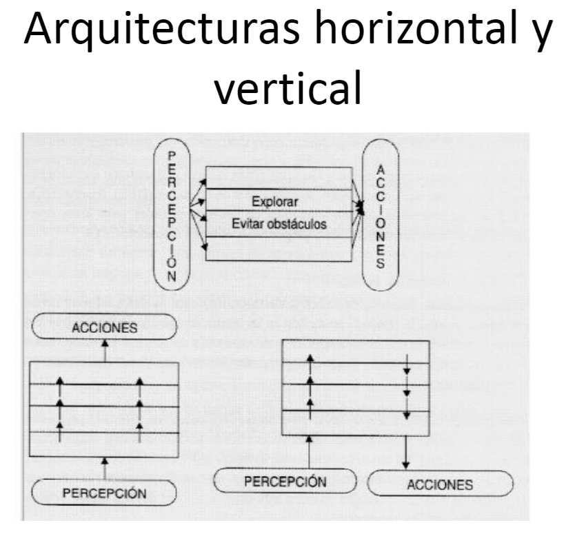
</p>

<div style="page-break-after: always;"></div>

## 2. Características de los Agentes reactivos y deliberativos. Similitudes y diferencias. Arquitecturas

### Agentes reactivos

Un **agente reactivo**, tras percibir el entorno a través de sus sensores, actúa de forma rápida y efectiva. Tienen una representación interna de su entorno. Toman acciones basadas en el presente, sin tener en cuenta las del pasado. Son agentes relativamente simples y actúan con con otros de manera

Características:
- Comportamiento diseñado de manera explícita. Necesario anticipar todas las opciones.
- Cálculos sencillos y rápidos.
- Sin historial de percepciones.
- Tienen un sistema de reglas.
- Usan arquitecturas horizontales.

#### Arquitectura de subsunción

La arquitectura de subsunción consiste en agrupar módulos de comportamiento. Cada módulo de comportamiento tiene una acción asociada, recibe la percepción directamente y comprueba una condición. Si esta se cumple, el módulo devuelve la acción a realizar. Un módulo se puede subsumir en otro. Si el módulo superior del esquema se cumple, se ejecuta este en lugar de los módulos inferiores. (Mirar fotos tema 2, página 22)

#### Agentes reactivos con memoria

Limitaciones del sistema sensorial de un agente. Para mejorar la precisión teniendo en cuenta la historia sensorial previa se implementan sistemas con memoria. La representación de un estado en el instante t+1 es función de la entradas sensoriales en el instante t+1, la representación del estado en el instante anterior t y la acción seleccionada en el instante anterior t. (Mirar fotos tema 2, página 24).

Adicionalmente el robot podría utilizar otras estructuras de datos: matriz que almacene el mapa con las casillas libres u ocupadas en el momento en el que se percibieron.

#### Sistemas basados en pizarras
Son extensiones de los sistemas de producción. En el agente existen varios programas denominados Módulos de Conocimiento(MC), formados por una parte de condición y otra parte de acción. Existe una memoria común a todos los MC denominada pizarra.

Cada MC es "experto" en una parte concreta del problema a resolver. Cuando se cumple su condición, un MC puede actualizar la pizarra, realizar una acción concreta o ambas. Es necesario implementar un programa de resolución de conflictos cuando dos MCs pueden actuar simultáneamente, decidiendo cuál actúa y cuál no o, en su caso, el orden de ejecución de ambos.

La actualización de una parte de la pizarra correspondiente a un MC  puede desencadenar la ejecución de otros MCs. La pizarra, por tanto, alberga la solución que se está construyendo conforme al objetivo general del agente.


### Agentes deliberativos

Los **agentes deliberativos** disponen de un modelo del mundo y otro de los efectos de sus acciones en el mismo. Toman decisiones a través del razonamiento lógico, y son capaces de recordar sus acciones pasadas. Todo esto lo hacen con la finalidad de lograr su objetivo.

Características:
- Tienen un conocimiento del mundo.
- Cálculos más complicados.
- Elaboran planes en base a los efectos de sus acciones en los modelos de los que dispone.
- Usan arquitecturas verticales.


<div style="page-break-after: always;"></div>

## 3. Describir brevemente los métodos de búsqueda no informada

Los **métodos de búsqueda no informada** son estrategias de búsquedas en las que se evalúa si el siguiente estado es mejor o peor que el anterior. A priori no se conoce. Se dice que son no informados puesto que no se tiene conocimiento previo de la longitud o coste de la solución.

Veamos algunos de los algoritmos más conocidos:

### Búsqueda en anchura

Algoritmo basado en grafos que explora de forma equitativa en todas las direcciones. Es un algoritmo muy útil, no solo para búsqueda de caminos general. Se caracteriza porque siempre encuentra la solución menos profunda primero. Es completo, puesto que recorre todos los posibles estados. Además, la solución es la óptima si se supone que todas las acciones tienen un costo equitativo.

La implementación es muy sencilla:
1. Se coge una localización de la frontera y se quita de ella.
2. Se expanden todos sus vecinos. Todo vecino que no hallamos visitado todavía se añaden a la frontera, así como al conjunto de nodos visitados.

Se suele implementar mediante una estructura FIFO.

### Búsqueda de Costo Uniforme

También conocido como el **algoritmo de Dijkstra**. Este es un algoritmo similar al anterior, salvo que minimiza el costo desde el origen hasta el destino si tratamos con un grafo dirigido. En cada movimiento se mantiene un recuento del coste del plan. El siguiente nodo a expandir será aquel cuyo coste sea el menor. Se implementa con una cola con prioridad.

### Búsqueda en profundidad

Se basa en expandir el nodo más profundo de la frontera actual del árbol de búsqueda. Se implementa con un stack. En general, la solución hallada no suele ser la óptima. Además, la completitud está garantizada solo para la búsqueda en grafos y con un espacio finito de estados.

Se puede limitar la profundidad imponiendo un límite. Solo desarrollará caminos que no superen dicho límite, haciendo backtracking a los que no ha desarrollado.

Finalmente, puede utilizarse una búsqueda con profundización iterativa. Se llama al método anterior aumentando en uno la profundidad hasta la que buscar.

### Búsqueda bidireccional

Se ejecutan dos búsquedas simultáneas: una hacia delante desde el estado inicial, y otra hacia atrás desde el objetivo. Se para cuando ambas búsquedas se encuentren. Se comprueba que el nodo expandido de un árbol esté en la frontera del otro


<div style="page-break-after: always;"></div>

## 4. El concepto de heurística. Cómo se construyen las heurísticas. Uso de las heurísticas en IA

### El concepto de heurística

Una **heurística** es un criterio, método o principio para decidir qué acción es la más apropiada entre un conjunto de acciones disponibles con el fin de lograr un objetivo. Este método no tiene por qué ser el óptimo, perfecto o racional, pero debe ser suficiente para alcanzar una solución sencilla y rápida de encontrar. Se usan para acelerar la búsqueda de soluciones.

Sin embargo, debemos encontrar un punto dulce en temas de complejidad: la solución debe ser fácil de encontrar gracias a la heurística, pero dicha solución debe ser lo mejor posible. Una mala no nos interesa.

Tampoco podemos garantizar que la solución sea la óptima. Pero en media se producen resultados satisfactorios en la resolución de problemas.

La heurística no es un concepto exclusivamente informático. Se lleva usando desde hace mucho tiempo. Reglas sencillas como *si no se entiende un problema, intenta dibujarlo* o *intenta derivar de una solución para entender el problema* han sido usadas a lo largo de la historia innumerables veces.

### Cómo se construyen las heurísticas

No existe un método científico que nos permita construir una heurística. La creación de una puede considerarse un proceso de descubrimiento. Aunque, en general, una buena opción es empezar por simplificar un problema, rebajando sus condiciones.

Una función heurística depende de la descripción de los nodos, la información obtenida hasta ese punto de búsqueda, y de cualquier información extra que pueda darnos el dominio del problema.

### Uso de las heurísticas en IA

Cuando en Inteligencia Artificial se realizan búsquedas, se suele recurrir a una heurística. Esta encapsula el conocimiento experto que se tiene sobre un problema y sirve como guía para el algoritmo de búsqueda.

Numeremos algunos ejemplos de heurísticas comunes usadas en IA:
- En navegación de mapas bidimensionales se suele utilizar la distancia Manhattan si solo nos podemos mover en 4 direcciones. Si se admite la diagonal, se utiliza la distancia Diagonal. En mapas hexagonales, se puede usar la distancia Manhattan adaptada.
- La heurística *Killer heuristic* se utiliza en la poda alfa-beta para juegos competitivos de dos jugadores con el fin de acelerar el algoritmo minimax.
- Los antivirus normalmente utilizan heurísticas que detectan los patrones o comportamientos comunes de los virus.


<div style="page-break-after: always;"></div>

## 5. Los métodos de escalada. Caracterización general. Variantes

Los **métodos de escalada** son técnicas de búsqueda informadas que se basan en seleccionar la mejor solución dada por una heurística en el vecindario de una solución inicial, e ir viajando por las soluciones del espacio hasta encontrar un óptimo local o global.

Están basados en búsquedas locales. En este caso, no nos importa el camino con el que llegamos a la solución, pues lo único relevante es el objetivo en sí. Por tanto, no es necesario guardar el camino. Funcionan con un solo estado actual, y generalmente se mueven solo a los vecinos del estado.

Suelen usar muy poca memoria (por lo general una cantidad constante), y suelen encontrar a menudo soluciones razonables en espacios de estados muy grandes.

Los distintos métodos de búsqueda local se diferencian en el modo en el que determinan la vecindad de cada nodo en estudio. Veamos algunos de ellos:

- El **algoritmo de escalada simple** considera que la vecindad de un nodo es el conjunto de hijos obtenidos secuencialmente hasta que aparece uno mejor que el padre. Es decir, la vecindad son todos los hijos hasta que encuentra uno mejor que el padre. El principal problema de este algoritmo es que al obtener los hijos secuencialmente, la vecindad generada depende del orden en el que se vayan generando. Si la solución es imposible, explotará todo el árbol de posibilidades, lo cual hace que sea muy lento.
- El **algoritmo de escalada por máxima pendiente** (hill climbing) considera que la vecindad de un nodo es el conjunto de todos sus hijos obtenidos secuencialmente. El funcionamiento es igual que el de escalada simple, pero abriendo todos los nodos y eligiendo el mejor. En el algoritmo, se selecciona el mejor hijo, el cual pasa a ser el nodo en curso. Es rápido pero no completo. Es útil cuando la función es monótona.
- Los **algoritmos con variaciones estocásticas** se usan para intentar salir de máximos/mínimos locales. Todos tienen el problema de no saber cuándo parar.
    - El **algoritmo de escalada estocástico** escoge aleatoriamente entre los sucesores con mejor valoración que el actual.
    - La **escalada de primera opción** genera aleatoriamente sucesores escogiendo el primero con mejor valoración que el estado actual.
    - La **escalada con reinicio aleatorio** repite la búsqueda varias veces, pero partiendo cada vez de un estado inicial distinto.
    - El **algoritmo de enfriamiento simulado** se basa en el proceso de temple en metalurgia. La idea básica es que se permita **descender en algunos nodos** de forma controlada. Esto, aparentemente, lleva a soluciones peores. No obstante, con el tiempo siempre se mueve a soluciones mejores. En vez de elegir el mejor nodo, escoge uno aleatorio. Si la situación mejora, se coge este nodo como el actual. Cuanta mayor sea la temperatura, más probabilidad habrá de que al generar como sucesor un estado peor éste sea elegido. La elección de un estado peor estará en función de su diferencia de calidad con el estado actual; cuanta más diferencia, menos probabilidad de elegirlo. Este algoritmo es eficiente y fácil de implementar. Sin embargo, el ajuste de los distintos parámetros puede llevar a muchas pruebas de ensayo y error.

<p align="center">
  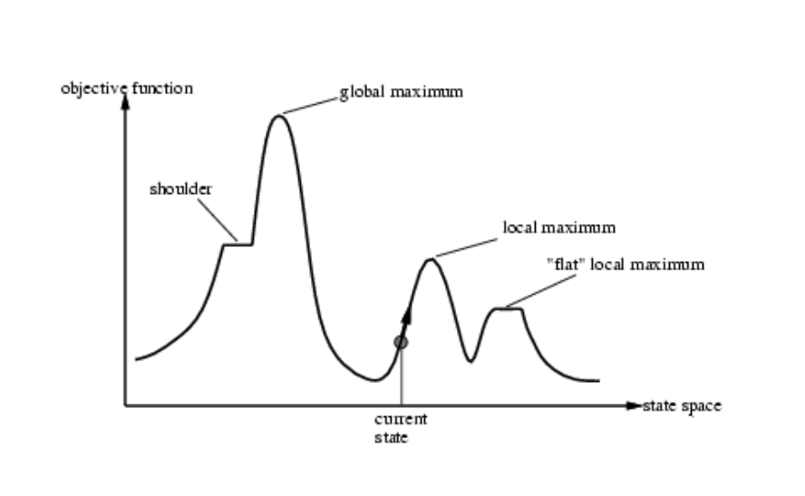
</p>

<div style="page-break-after: always;"></div>

## 6. Características esenciales de los métodos “primero el mejor”

Son algoritmos basados en las variantes de Dijkstra. Se basan en la hipótesis de se expandirá primero el mejor de los nodos encontrados, puesto que esto nos debe servir para llegar a la solución de manera más rápida. En su desarrollo, se utilizan dos listas: una de nodos abiertos y otra de cerrados.

En la de abiertos mantenemos aquellos que se han generado pero no se han analizados con la función heurística; es decir, no se han generado sucesores. Se ordena en función del valor asignado por la heurística.
En la de cerrados mantenemos aquellos que se han examinado. Se usa para saber cuándo un nodo ha sido visitado con anterioridad.

El procedimiento es el siguiente:

1. Crear un grafo `G`, nodo inicial `I`.
2. Inicializar la lista de abiertos con I y la de cerrados = ø. Inicializar variable de éxito a `false`
3. Mientras la lista de abiertos no esté vacía o éxito no sea `true`:
    1. Quitar el primer nodo de abiertos (`N`) y meterlo en la lista de cerrados.
    2. Si `N` es el estado final, éxito = `true`
    3. Si no, expandir `N` generando el conjunto `S` de sucesores de `N` que no son antecesores de éste en el grafo.
    4. Generar un nodo en `G` por cada sucesor de `S`.
    5. Establecer un puntero a `N` desde aquellos sucesores que no estuvieran en `G` y añadirlos a abiertos.
    6. Para cada sucesor en `S` que ya estuviera en abiertos o cerrados, decidir si redirigir sus punteros hacia `N`.
    7. Para cada sucesor en `S` que ya estuviera en la lista de cerrados, decidir si redirigir los punteros de los nodos en sus subárboles.
    8. Reordenar los abiertos según la heurística.
4. Si éxito es `true`, entonces la solución es el camino desde `I` hasta `N` a través de los punteros de `G`.
5.
<div style="page-break-after: always;"></div>

## 7. Elementos esenciales del algoritmo A*

El algoritmo A* es del tipo *primero el mejor*. La función de evaluación es la suma de las dos componentes:  $f(n) = g(n) + h(n)$, donde
- $g(n)$ indica la distancia del mejor camino obtenido hasta el momento (desde el nodo inicial hasta el enésimo nodo $n$)
- $h(n)$ es la heurística y expresa la distancia estimada desde el nodo $n$ hasta el objetivo.

Por tanto, $f(n)$ expresa el coste más barato estimado de la solución a través de $n$.

La elección de la heurística es importante en A*. Idealmente, queremos que la función tome valores por debajo del coste de llegar al destino. Si $h$ toma valores mayores, se tendrá un rendimiento mayor a costa de peor exactitud. Por tanto, debemos imponernos la restricción de no elegir una heurística que sobreestime el coste de llegar hasta el destino.

A la hora de implementarlo, se tienen dos listas: una de cerrados y otra de abiertos. En la de abiertos se encuentran los nodos que se han generado pero aún no se han expandido, ordenados según la función. En la de cerrados se hallan los que ya se han expandido. En cada paso se selecciona el nodo más prometedor y se inserta en la lista de cerrados. Después, se generan los sucesores, y se incluyen en los abiertos. Si el mejor de los abiertos es el objetivo, se acaba. Si no, se continúa.

Realmente, es una búsqueda en anchura en la cual podemos abandonar temporalmente una rama que no parece prometedora y continuar con otra. Sin embargo, la vieja rama no se olvida. Su último nodo se almacena en el conjunto de generados, pero aún sin expandir.

### Propiedades

Si definimos $f^*$ como el coste del camino óptimo, se tiene lo siguiente:
- A* expande todos los nodos con $f(n) < f^*$
- A* seleccionará entonces algunos nodos en el entorno del objetivo, para los cuales $f(n) =/*$ antes de seleccionar el nodo destino.

Intuitivamente, es obvio que la primera solución encontrada debe ser la óptima, pues los nodos vecinos tendrán todos un coste mayor en $f$, y por tanto, un coste mayor en $g$.

En grafos finitos con aristas no negativas, A* está garantizada su terminación y es **completo**; esto es, que siempre encontrará una solución si ésta existe.

Decimos que un algoritmo de búsqueda es **admisible** si se garantiza que el valor de retorno es una solución óptima. En A*, si la heurística es admisible, entonces A* es admisible. Una heurística admisible es aquella que cumple que $0 \leq h(x) \leq h^*(x) \quad \forall x$, donde $h^*(x)$ es el coste del camino óptimo en el árbol de estados para alcanzar la solución desde el nodo $x$.

Además, si una heurística está mejor **informada** que otra, entonces, con la primera se requieren menos pasos para alcanzar la solución.

### Limitaciones

Los principales problemas del algoritmo vienen dados por:
- El uso de memoria al expandir una gran cantidad de nodos
- La necesidad de encontrar una heurística admisible y consistente.
- No en todos los problemas se tiene conocimiento del estado final. En su lugar, se tiene una función objetivo que se desea optimizar.
- Es necesario conocer un estado inicial del problema del que se parte para solucionar el problema.


<div style="page-break-after: always;"></div>

## 8. Elementos esenciales de un algoritmo genético

Los **algoritmos genéticos** son heurísticas de búsqueda inspiradas por la teoría de la selección natural de Darwin. Son métodos usados a menudo para la resolución de problemas de búsqueda y optimización. Aplican estrategias biológicas basadas en reproducción sexual, mutación y adaptación.

Conceptos:
- **Cromosomas**: representación de una solución al problema.
- **Gen**: atributo concreto del vector de representación de una solución.
- **Población**: conjunto de soluciones que se crean para el problema.
- **Fitness**: valor de la función objetivo.
- **Selección natural**: operador de selección.
- **Mutación**: operador de modificación.
- **Cambio generacional**: operador de reemplazamiento.

El modo en el que funcionan este tipo de algoritmos es el siguiente:

Se genera aleatoriamente una población inicial constituida por cromosomas. A cada cromosoma se le aplica una función de fitness, con el fin de comparar soluciones.

En general, se desconoce cuál es la solución óptima. Por ello, se utilizan dos criterios: limitar el número de iteraciones (generaciones) o detenerlos cuando el cambio que se produzca sea menor que un umbral. En cada iteración se realiza lo siguiente:

1. Selección: después de conocer la aptitud de cada cromosoma, se eligen aquellos que se van a utilizar para el cruce (reproducción). Cuanto mayor sea la aptitud, mayor es la probabilidad de ser usado para el cruce.
2. Cruzamiento: principal operador. Se utiliza sobre dos cromosomas a la vez, y genera dos descendientes donde se combinan características de ambos según cierto criterio.
3. Mutación: al azar se modifica parte del cromosoma, con el fin de alcanzar zonas del espacio de búsqueda que no estaban cubiertas por los individuos de la población actual.
4. Reemplazo: una vez se han aplicado los operadores, se escogen los mejores individuos para formar la población de la generación siguiente.

Podemos describir el proceso de un algoritmo genético mediante el siguiente grafo:
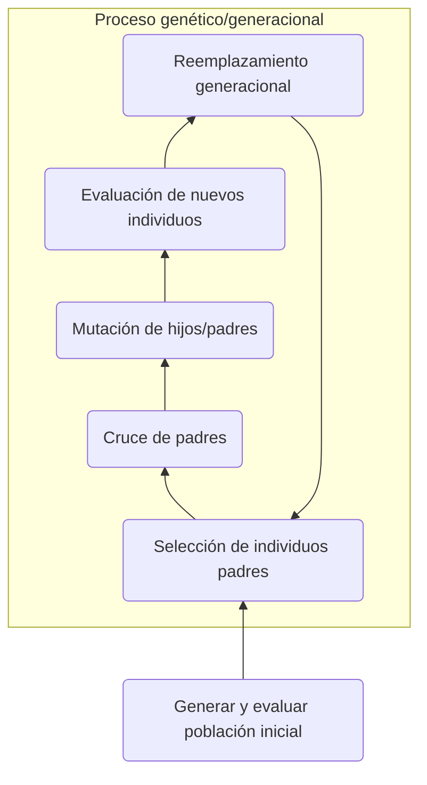

<div style="page-break-after: always;"></div>

# Segunda parte

## 1. Componentes de un juego

Un juego es cualquier situación de decisión con varios agentes/jugadores, gobernada por un conjunto de reglas y con un resultado bien definido. Se caracteriza por el hecho de que ninguno de los jugadores puede definir el resultado con su única actuación. Es decir, las decisiones que toma el otro afectan a las tuyas.

El tipo de juegos viene dado por las componentes que lo forman. Estas son:

- **Número de jugadores**.
- **Existencia de movimientos de azar**: un juego se denomina determinista si no existen movimientos de azar.
- **Orden de actuación de jugadores**.
- **Existencia de pagos colaterales**: si las decisiones de un jugador benefician a otro, se puede alcanzar un equilibrio de Nash; esto es, una situación en la que los jugadores están satisfechos con el estado del juego.
- Otras características determinan su propio tipo de juego. Por ejemplo: juegos de suma nula o no nula. Se incluirán en la siguiente sección.


Todas estas componentes sirven para construir el **árbol de juego**, el cual nos permite analizar los posibles movimientos y sus valores para calcular el óptimo.

En general, los juegos pueden ser vistos como un problema de optimización. Por tanto, han sido sujeto de estudio de gran interés durante mucho tiempo, dando lugar a la **Teoría de Juegos**.

Los juegos pueden llegar a ser de tipos totalmente distintos. Las diferencias son tan sustanciales que pueden definir sus propias áreas de investigación. Algunos de estos tipos son:

- **Juegos de suma nula o no nula**. En los juegos de suma nula, la suma de las puntuaciones de todos los jugadores es 0. El póker es un ejemplo de éstos. En los juegos de suma no nula, el incremento de la puntuación de un jugador no tiene por qué implicar un decremento en la de otro.
- **Juegos simétricos y asimétricos**: un juego simétrico se caracteriza por el hecho de que el resultado de una cierta estrategia depende solo de las otras estrategias usadas, no de quién las juega.
- **Juegos cooperativos/no cooperativos**: En los primeros, los jugadores pueden formar alianzas forzadas externamente, mientras que los otros se caracterizan por no obligar a cooperar o, directamente, imposibilitan la formación de alianzas.
- **Juegos simultáneos y secuenciales**: los juegos simultáneos son aquellos en los que todos los jugadores realizan sus acciones a la vez, o aquellos en los que los jugadores que toman acciones después no conocen las jugadas previas de los otros. En los juegos secuenciales los jugadores conocen los movimientos previos de los otros jugadores y pueden actuar consecuentemente.
- **Juegos de información perfecta o imperfecta**: En los juegos de información perfecta, todos los jugadores tienen conocimiento del estado del juego.
- **Juegos de longitud infinita**.
- **Juegos combinatorios**: la dificultad de encontrar una estrategia óptima viene de la cantidad de movimientos posibles. Un ejemplo es el ajedrez. Normalmente los juegos de información imperfecta suelen tener un carácter combinatorio.
- **Juegos diferenciales**: la evolución de las variables de estado de los jugadores se rige por ecuaciones diferenciales.
- **Metajuegos**: estos juegos tratan de desarrollar reglas para otro juego, el objetivo o el jugador.

Formalmente, en Inteligencia Artificial, puede definirse un juego por
- Un **estado inicial**.
- **Función sucesor**, que determina qué movimientos son legales y la siguiente posición
- Un **test terminal**, que nos indica cuándo se acaba el juego
- Una **función de utilidad**, que da un valor numérico a los estados terminales


<div style="page-break-after: always;"></div>

## 2. ¿Qué es el factor de ramificación y cómo afecta a la complejidad de un juego? Describe en líneas generales el algoritmo minimax y el de la poda alfa-beta

### Descripción

El factor de ramificación es el número medio de nodos hijos que se genera por cada nodo. Este factor nos permite conocer cuántos movimientos posibles se puede hacer por turno. Esto nos proporciona una medida de la complejidad: cuanto mayor es el factor, más complejo se vuelve el juego, dado que el número de movimientos es mayor. Consecuentemente, el tamaño del árbol también se ve proporcionalmente afectado por dicho coeficiente.
No obstante, no solo el factor de ramificación determina la complejidad de un juego. A modo de ejemplo: el árbol del GO es mayor que el del ajedrez, pero el ajedrez se considera más complejo.

Uno de los principales problemas de la exploración de grafos es que el análisis podría no ser computacionalmente viable. Por ejemplo: el favor de ramificación del ajedrez es 35. Con 20 movimientos, cada jugador tendría aproximadamente 35^40 nodos para explorar. Únicamente son 20 movimientos. Conforme se avanza, más difícil se vuelve. Por ello, debemos buscar una forma de calcular soluciones viables aunque no sean las óptimas. Para ello, se han desarrollado una serie de algoritmos. Uno de los más famosos es el algoritmo MiniMax

El **algoritmo Minimax** es una regla de decisión usada en inteligencia artificial para minimizar el número de pérdidas en el peor de los casos, o para maximizar la ganancias en el mejor de los casos. En el último, se denomina al algoritmo maximin. Se basa en juegos de suma nula. Es utilizado en juegos bipersonales por turnos de suma nula con información perfecta.

No obstante, no todos los juegos se pueden se pueden resolver. Los que tienen árboles complejos resultan imposibles de explorar en su totalidad. Por tanto, debemos distinguir entre juegos en los que sí podamos recorrer el árbol completo de los que no. Para esto, se intenta buscar una buena jugada inmediata. Es de gran importancia la heurística para conseguirlo.

### Algoritmo

Denotamos `Max` al primer jugador y `Min` al segundo. Los nodos terminales se etiquetan con `V` si indican victoria, `D` derrota o `E` para empate.

Definamos lo que vale V(J):
- Si J es un nodo de la frontera => V(J) = evaluación estática.
- Si J es un nodo Max => V(J) = máximo de sus valores sucesivos.
- Si J es un nodo Min => V(J) = mínimo de sus valores sucesivos.

Procedimiento:
```
Si J es un nodo terminal, devolver V(J) = f(J). En otro caso:

Para k = 1, ... , b:
  Generar J_k
  Calcular V(J_k)

  Si k == 1:
    AV(J) = V(J_k)

  Si K >= 2:
    Si J es un nodo Max:
      AV(J) = máx{AV(J), V(J_k)}

    Si J es un nodo Min:
      AV(J) = mín{AV(J), V(J_k)}


Devolver V(J)
```

### Optimizando Minimax mediante la poda alfa-beta

El problema de este algoritmo es que el número de estados que tiene que examinar es exponencial. No podemos, por tanto, eliminar el exponente. Pero esto no nos impide dividirlo, con eficacia, a la mitad. Introducimos, por tanto, la **poda alfa beta**.

Este algoritmo se encarga de parar la evaluación de un movimiento cuando se ha encontrado al menos un movimiento cuya evaluación es peor que otro que ya se había examinado. Dicho movimiento no necesita ser desarrollado. Cuando se aplica a un árbol minimax estándar se devuelve el mismo movimiento, pero poda todas las ramas que no influyen en la decisión final.

El algoritmo mantiene dos valores, $\alpha$ y $\beta$, que representan el valor mínimo que el jugador maximizador se asegura, y el valor máximo que el jugador minimizador se asegura. Inicialmente, $\alpha = -\infty$, $\beta = \infty$.

Cuando el valor máximo que se asegura el jugador minimizador (esto es, el jugador $\beta$) se vuelve menor que la mínima puntuación que el valor minimizador se asegura (es decir, el jugador $\alpha$), entonces no se consideran los descendientes del nodo, dado que no se jugarán nunca. Es decir, cuando $\alpha > \beta$, entonces no se desarrolla.

La búsqueda va actualizando los valores $\alpha$ y $\beta$ conforme se ejecuta el algoritmo.

<div style="page-break-after: always;"></div>

## 3. ¿Qué problemas plantea el cálculo de predicados en la resolución de problemas de IA?

Existen varios problemas en el cálculo de predicadores. Enumeraremos algunos de ellos:

### Problemas semánticos

1. **Expresar todo en fórmulas lógicas** es complicado. Las heurísticas, como se vio, ya son de por sí difíciles de expresar. Ahora, aparte de estas, debemos añadirles la necesidad de escribir metaconocimiento, jerarquía y herencia, así como igualdad y sentido común entre otras.
2. Es complicado hacer **razonamientos acerca de predicados**. No se pueden hacer proposiciones acerca de predicados. Además, estos siempre se aplican a objetos o a funciones, pero nunca se puede tener un predicado sobre un predicado. Esto hace que, por ejemplo, podamos decir que la propiedad ser estudios@ es inteligente, sino que dicha propiedad pertenece al conjunto de cosas inteligentes.
3. **Razonar sobre el tiempo** es complejo. A cada instante puede cambiar el estado del conocimiento. En principio, el tiempo es continuo. No obstante, para trabajar con este, normalmente se suele discretizar, por lo que complica la representación. Asimismo, debemos añadir acciones, operadores de incrementos temporales, cambios de situaciones...
4. **Información incompleta o imprecisa**. El mundo real está lleno de ella. Es una cantidad de imprecisión importante. Entonces, ¿Cómo podríamos obtener conocimiento objetivo mediante predicados si partimos de imprecisiones o verdades a medias?
5. **Excepciones**: aunque tengamos reglas generales, siempre se podrían producir casos en los que no se cumplen. Por ejemplo, los humanos tienen dos piernas en general, pero puede haber humanos sin alguna extremidad. Se complica, por lo tanto, expresar información de forma precisa y concisa.
6. **Monotonía**: la lógica de predicados es monótona. Esto dificulta la actualización de las Bases de Conocimiento.

### Problemas computacionales

1. **Falta de consistencia**: lo que se demuestra verdad, ¿lo es realmente? Podría ocurrir que se demostrara algo que luego no es cierto. Este problema viene derivado del último problema semántico que hemos mencionado. Otro ejemplo de falta de consistencia son las paradojas.
2. La lógica de predicados **no es completa**. Algo podría ser verdadero y no se podría demostrar. Dependemos de los axiomas para poder demostrarlos. La elección de éstos es clave.
3. Finalmente, la lógica es **compleja computacionalmente**. El árbol de predicados se expande exponencialmente. Esto hace difícil su computación.

<div style="page-break-after: always;"></div>

## 4. Modelos de conocimiento heredable ¿Qué tipo de conocimiento organizan las redes semánticas? Describir en líneas generales el concepto de "frame".

Los modelos de conocimiento heredables son un intento de acercamiento a la forma en la que almacenamos nosotros, los humanos, el conocimiento.

En las **redes asociativas**, cada nodo representa un concepto (o una proposición), y los enlaces corresponden a relaciones (inclusión, pertenencia o causalidad) o a categorías gramaticales. Entre ellas, se conocen:
- **Redes de clasificación**: clasifican conceptos u objetos con sus características propias (herencia, por ejemplo).
- **Redes causales**: son las que llevan asociadas juntos a sus nodos una relación de influencia, representada por los enlaces.
- **Redes semánticas**, que veremos en la siguiente sección.

### Redes semánticas

Las redes semánticas son aquellas destinadas a representar o a comprender el lenguaje natural. Se representan como un grafo dirigido, etiquetado y construido por nodos y arcos. Los arcos representan las relaciones. Estas relaciones son *ejemplo/instancia de*, *subclase de* y *parte de*. Los nodos representan conceptos.

La herencia es el mecanismo de razonamiento utilizado en este tipo de redes. Un nodo hereda las propiedades de los conceptos que se encuentran más altos en la jerarquía, como suele ocurrir con la herencia. Esta herencia se produce a través de las relaciones *subclase de* e *instancia de*.

Las redes semánticas tienen el problema de volverse completamente inmanejables conforme aumenta la complejidad del sistema a representar. Están limitadas a la hora de tratar con formas de inferencia sofisticada. No obstante, son las precursoras del sistema de **frames**.

Aquí tenemos un par de ejemplos de red semántica la encontramos en la siguiente foto:

<p align="center">
  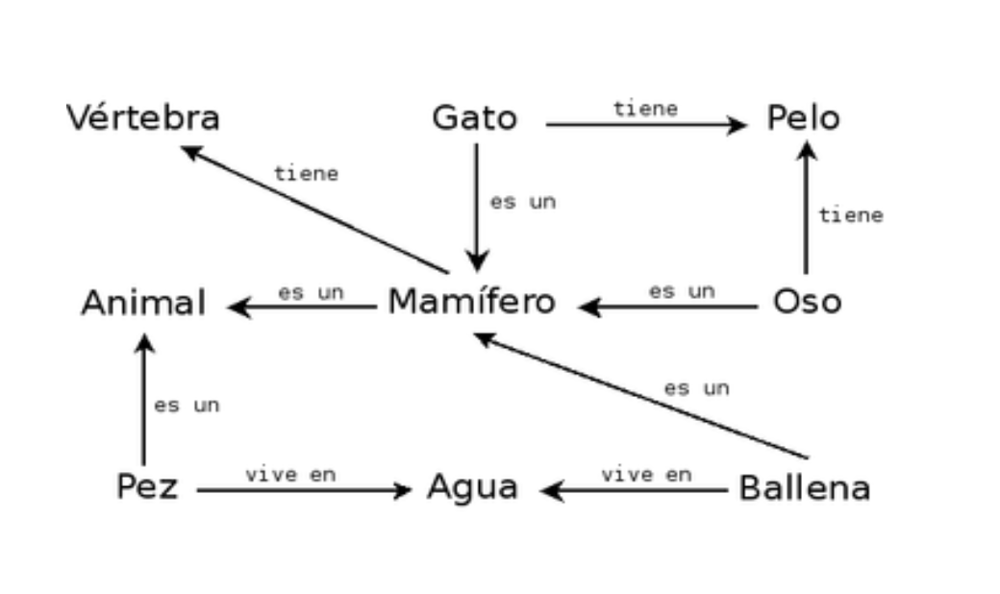
</p>

El siguiente es más complejo:

<p align="center">
  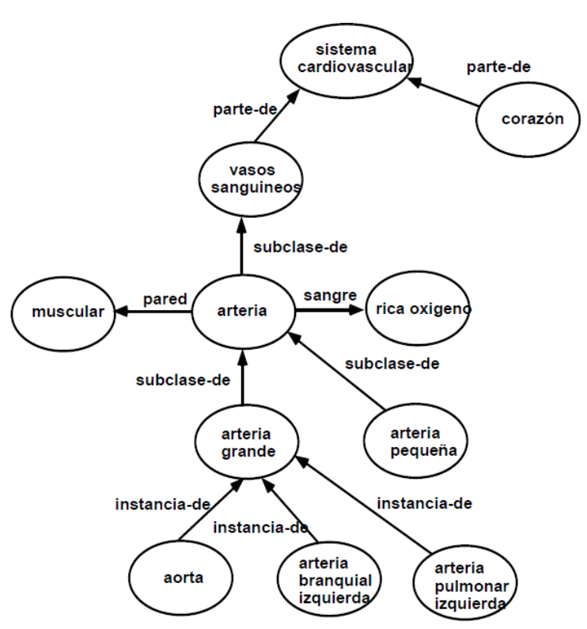
</p>

### Frames

Los frames son estructuras de datos usadas para representar una situación estereotipada. Se basan en el concepto de considerar la resolución de problemas humana como el proceso de rellenar huecos de descripciones parcialmente realizadas. La idea subyacente es que el conocimiento concerniente a individuos o clases de individuos, así como sus relaciones, en dicha estructura.

Tipos de frames:
- **Frames clase**, o frames genéricas: representan el conocimiento de clases de objetos.
- **Frames instancia**: representan conocimiento de objetos individuales.

Un conjunto de frames que representa el conocimiento de un dominio de interés es organizada jerárquicamente en lo que es llamado una **taxonomía**. Esta está asociada a un método de razonamiento automático llamado herencia. Esta taxonomía es representada mediante un grafo dirigido acíclico en el que solo se dan relaciones del tipo *instancia-de* y *subclase-de*. Cada nodo simboliza un frame.

Cada frame de una taxonomía tiene un nombre único y solo puede tener una superclase. La información específica a cada concepto representado por un frame es representada mediante atributos o slots. Ofrecen un medio de representar las propiedades de objetos individuales o clases de objetos.

Algunos ejemplos de frames son:

<p align="center">
  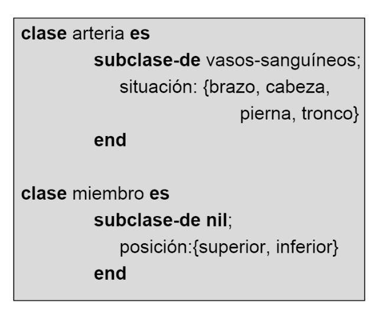
  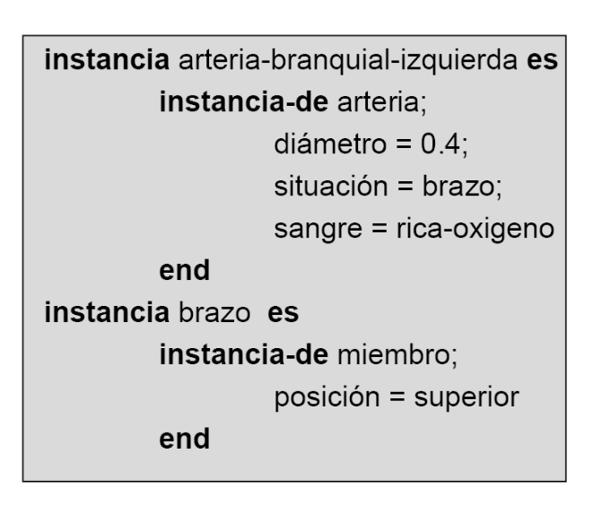
</p>

La notación de los frames no permite saber si el valor de una instancia ha sido heredado o ha sido especificado explícitamente. Asimismo, no permite calcular los valores de un atributo a partir de los valores de otro atributo.

Para solucionar dichos problemas, surgen las **facetas**, unas extensiones de la definición de frame.

### Faceta

Una faceta es una propiedad asociada a un atributo. Indican algún tipo de información sobre dicho atributo. Estos pueden ser el valor por defecto, cardinalidad, valor real, si es heredado,  o incluso la integración de conocimiento declarativo y procedural (las denominadas facetas demonio).

<div style="page-break-after: always;"></div>

## 5. Estructura y componentes de un sistema experto

Un **sistema basado en conocimiento** (SBC) es aquel programa que utiliza masivamente conocimiento para resolver un problema dentro de un dominio determinado. Un **sistema experto** (SEBC) es un sistema basado en conocimiento que se comporta como un humano experto en un determinado dominio de actividad. Puede ser consultado y justifica su razonamiento.

Un SBC necesita 3 componentes básicas:
- Una **base de conocimiento** que contenga el conocimiento necesario sobre el universo del problema a resolver. Por ejemplo: descripciones del mundo, objetos y relaciones entre ellos.
- Un **motor de inferencia**, que permita razonar sobre el conocimiento de la BC y los datos que aporte el usuario.
- Una **interfaz de usuario** para la entrada/salida de datos de cada problema. A veces, los datos de un problema se conocen como Base de Hechos.

Además, los sistemas expertos tienen implementado un módulo para dar explicaciones y justificaciones. Debe ser capaz de mostrar por qué se ha tomado cierta decisión.

Para la representación de los distintos formalismos se usa la tripleta <objeto, atributo, valor>. Esta pieza se puede transformar en conocimiento utilizable mediante reglas de producción, redes asociativas o redes de marcos.

Cada formalismo de representación usa un método de inferencia específico. Por ejemplo: para la lógica, utiliza la resolución lógica. Para las reglas de producción, el razonamiento hacia delante y hacia atrás.

Para construir un SBC, se debe realizar lo siguiente:
1. Extraer el conocimiento y estudiar la forma de representarlo de forma abstracta efectiva.
2. Representar el conocimiento con el formalismo adecuado para que la máquina pueda entenderlo.
3. Realizar inferencias para generar información útil.

Además, para construir el sistema experto:
1. Se extrae el conocimiento experto
2. Se modela y se adquiere el conocimiento utilizando un lenguaje adecuado.

El esquema de diseño de un sistema experto basado en reglas es el siguiente: la memoria de trabajo contiene la información relevante que el motor de inferencia está usando para razonar las respuestas.

Finalmente, demos algunos ejemplos de SBC:
- Anna, la agente conversacional de IKEA.
- Paciente Simulado Virtual utilizado para la formación en medicina.


<div style="page-break-after: always;"></div>

## 6. Paradigmas de Aprendizaje Automático.

El aprendizaje automático es la rama de de la Inteligencia Artificial que tiene como objetivo desarrollar técnicas para hacer que los ordenadores aprendan solos, sin estar explícitamente programados para ciertas tareas. Es decir, modificar el mecanismo de decisión del agente para mejorar su comportamiento. Estos programas mejoran con la experiencia.

Se dice que un programa aprende de la experiencia $E$ con respecto a una tarea $T$ existiendo alguna medida de rendimiento $P$ si su desempeño en $T$, medida por $P$ mejora la experiencia $E$.

Existen diferentes tipos de aprendizaje atendiendo a la forma de mejorar la experiencia:
- El **aprendizaje memorístico** es el más antiguo. Es la acción de introducir en la memoria un concepto o idea sin saber o entender su significado, sin tener ideas previas. SE tiene como instrumento las múltiples repeticiones de dicho concepto. De ese modo, se recuerdan posteriormente.
- El **aprendizaje deductivo** utiliza la deducción lógica con reglas para inferir nuevo conocimiento basándonos en el que teníamos previamente. Se utiliza tanto la inferencia y deducción ya mencionada como el razonamiento artificial.
- El **aprendizaje analítico** se basa en explicaciones. Se construye una explicación para cada ejemplo en relación con un concepto dado, y se generaliza. De esta forma, se puede usar en el futuro.
- El **aprendizaje analógico** consiste en entender y resolver una situación gracias a su parecido con otras resultas anteriormente. Esta técnica debe usarse con cautela, ya que se puede extrapolar abruptamente.
- El **aprendizaje inductivo** es el más ampliamente estudiado. Se trata de aprender un concepto o clasificación a partir de ejemplos y contraejemplos. Utiliza árboles de decisión para su desarrollo.

Si nos centramos en la forma en la que se produce la retroalimentación, encontramos 3 tipos distintos:
- **Aprendizaje supervisado**: para cada entrada, se dispone de un supervisor que proporciona una salida deseada. Es utilizado por los aprendizajes inductivos.
- **Aprendizaje no supervisado**: no se dispone de una salida deseada para cada entrada, sino que se busca agrupar los datos en función de ciertas características, denominadas medidas de distancia. Es utilizado por los aprendizajes inductivos también.
- **Aprendizaje por refuerzo**: basado en el conductismo. Se aprende a mediante procesos de ensayo-error en los que se obtienen señales de beneficio/coste. Es el más generalizado. Hay que tener cuidado con el diseño de las señales de retroalimentación, dado que pueden convertirse en armas de doble filo. A veces, no hay decisión correcta o incorrecta.


<div style="page-break-after: always;"></div>

## 7. Describir el problema del ruido y el del sobreajuste en aprendizaje automático.

Para describir el problema del ruido y el sobreajuste, necesitamos dar primero unas pocas definiciones para poder trabajar:

El objetivo del aprendizaje automático es aprender una función $f$, para hallar pares $(x, f(x))$. Para ello, debemos encontrar una hipótesis $h$ tal que $h = f$ sobre unos conjuntos de entrenamiento.

Diremos que una hipótesis está **bien generalizada** si permite predecir ejemplos que no se conocen. Esto es, que permite extrapolar nuestra capacidad de aprender a nuevos conocimientos. Además, diremos que una hipótesis es **consistente** si satisface a todos los datos.

A la hora de elegir una, aplicaremos la **Navaja de Ockham** (*En igualdad de condiciones, la explicación más sencilla suele ser la más probable*).

Diremos que un problema de aprendizaje es realizable si el espacio de hipótesis contiene a la función verdadera.

Pasamos pues, a hablar del problema del **ruido**. Este ocurre cuando se dan dos o más ejemplos con la misma descripción tienen diferentes clasificaciones. También puede ocurrir cuando los atributos no describen con suficiente detalle los datos, o porque el el dominio es no determinista. Este ruido se traduce en error. Es posible que el ruido proceda de datos que están mal en primer lugar. No podemos alterar los datos que ya teníamos previamente para resolverlo.

Una posible solución sería interpolar dichos ejemplos o estimar ciertas posibilidades para cada uno. También se podría intentar clasificar en dos categorías distintas y ver cuál produce mejores resultados para el aprendizaje.

No obstante, no tendría por qué saberse cuál de los ejemplos es incorrecto. Para ello, lo que se hace es tomar los ejemplos cuyas descripciones coinciden. Entonces, se comparan los resultados que se obtienen con la misma clasificación para éstos. Aquél que produzca mejor desempeño es el que se conserva.

El **sobreajuste** (en inglés, *overfitting*) ocurre cuando se encuentran regularidades poco significativas en los datos. Se aprende hasta el punto en el que se conocen los errores del set de entrenamiento. Por tanto, conseguimos hacer predicciones muy buenas en el conjunto de entrenamiento, pero falla en los conjuntos de test. Esto produce resultados muy pobres. Además, las funciones con sobreajuste suelen necesitar más información que la propia función óptima y son menos portables.

Para solucionarlo, se puede utilizar el remuestreo de datos o, simplemente, añadir más datos genéricos. Además, si utilizamos árboles de decisión, podemos podarlos para impedir divisiones recursivas sobre atributos irrelevantes.

También se puede utilizar la validación cruzada. Consiste en realizar $k$ experimentos, dejando a un lado cada vez $\frac{1}{k}$ de los datos para el test, y promediando los resultados. Con esta técnica se puede validar el aprendizaje.

Podemos concluir que la mejor hipótesis es aquella que tiene mejor ajuste sobre el conjunto total de los datos, aunque haya algún error de más.


<div style="page-break-after: always;"></div>

## 8. ¿Qué son y cómo se construyen los árboles de decisión?

Un árbol de decisión es una modelo de predicción utilizado en la Inteligencia Artificial. Toman como entrada un objeto o una situación descrita a través de un conjunto de atributos y devuelve una decisión. Esta decisión es el valor previsto de la salida para dicha entrada, y adquiere la forma Sí/No. Son, por tanto, funciones del tipo booleanas.

Es una de las técnicas más famosas de aprendizaje supervisado clasificatorio. Son una buena forma de introducirse al campo del aprendizaje inductivo, y son sencillos de implementar.

Tanto la salida como los atributos pueden ser discretos o continuos. En el caso de los primeros, si es discreta, estaríamos clasificando; y si es continua, haciendo una regresión.

Los árboles desarrollan una secuencia de un test para poder alcanzar una decisión. Cada nodo interno hace un test para el valor de una cierta propiedad. Las ramas están etiquetadas con sus posibles valores. Cada nodo hoja del árbol representa qué ha de ser devuelto si dicho nodo es alcanzado.

Esta manera de almacenar información en forma de grafos dirigidos es muy natural para el humano.

Por ejemplo, en el libro *Artificial Intelligence, a modern approach* de Rusell, encontramos un ejemplo de árbol de decisión para ver si una persona tendrá que esperar o no:

<p align="center">
  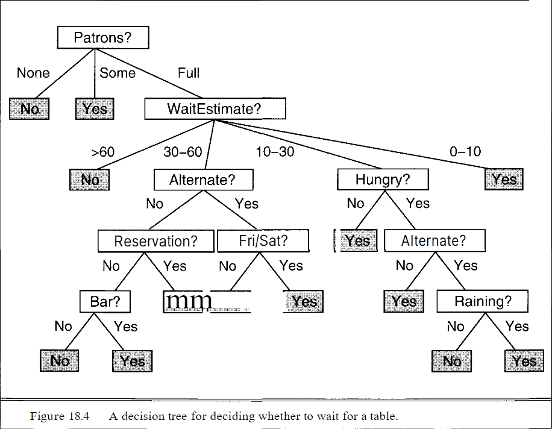
</p>

Necesitaremos ciertos ejemplos con sus respectivas salidas. Al conjunto de estos ejemplos los llamaremos **conjunto de entrenamiento**.

Una forma de construcción del árbol de decisión trivial es crear un árbol de decisión con un camino hasta una hoja para cada ejemplo. Este camino debe comprobar cada atributo, de forma que se desemboca en el ejemplo del set de entrenamiento. Decimos que es trivial porque no nos permite extraer ningún patrón aplicable a otras instancias del problema. Además, el árbol puede tener un tamaño desmesurado.

Por tanto, aplicando diferentes técnicas como la navaja de Ockham, conseguimos encontrar otros árboles más pequeños que son consistentes con nuestros ejemplos. No obstante, hallar el ínfimo en temas de tamaño es computacionalmente inviable.

Para arreglar este problema, podemos usar heurísticas simples para identificar árboles pseudo-óptimos. La idea básica del algoritmo es hacer el test primero sobre el atributo más importante. Se considera el atributo más importante aquel que discrimina el mayor número de ejemplos; es decir, el más significativo. Solo los ejemplos de entrenamiento que llegan al nodo siguiente se utilizan para elegir el nuevo atributo.

Como ejemplo, tenemos este desarrollo extraído de las diapositivas de Miguel Delgado Calvo-Flores:
<p align="center">
  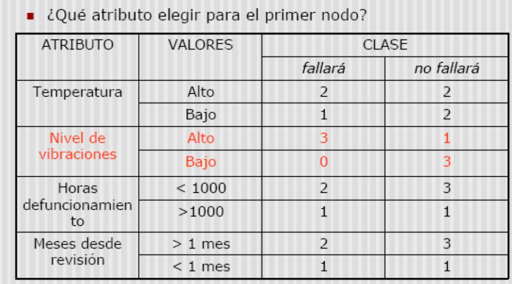
  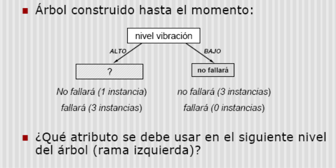
  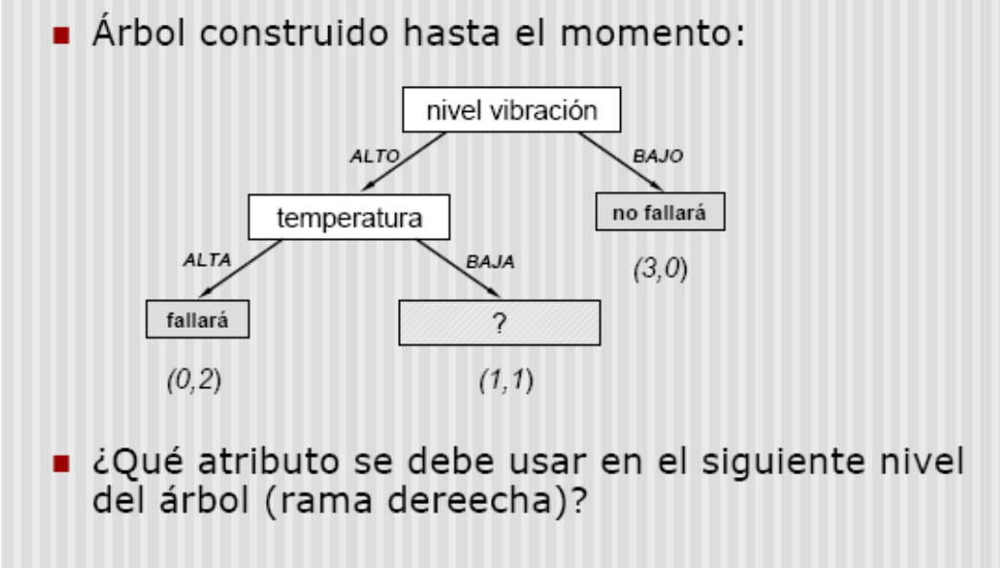
  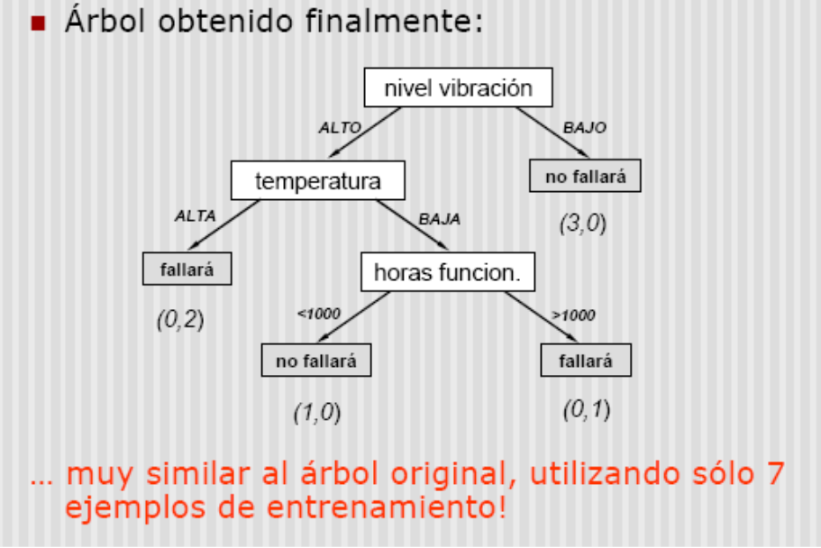
</p>
